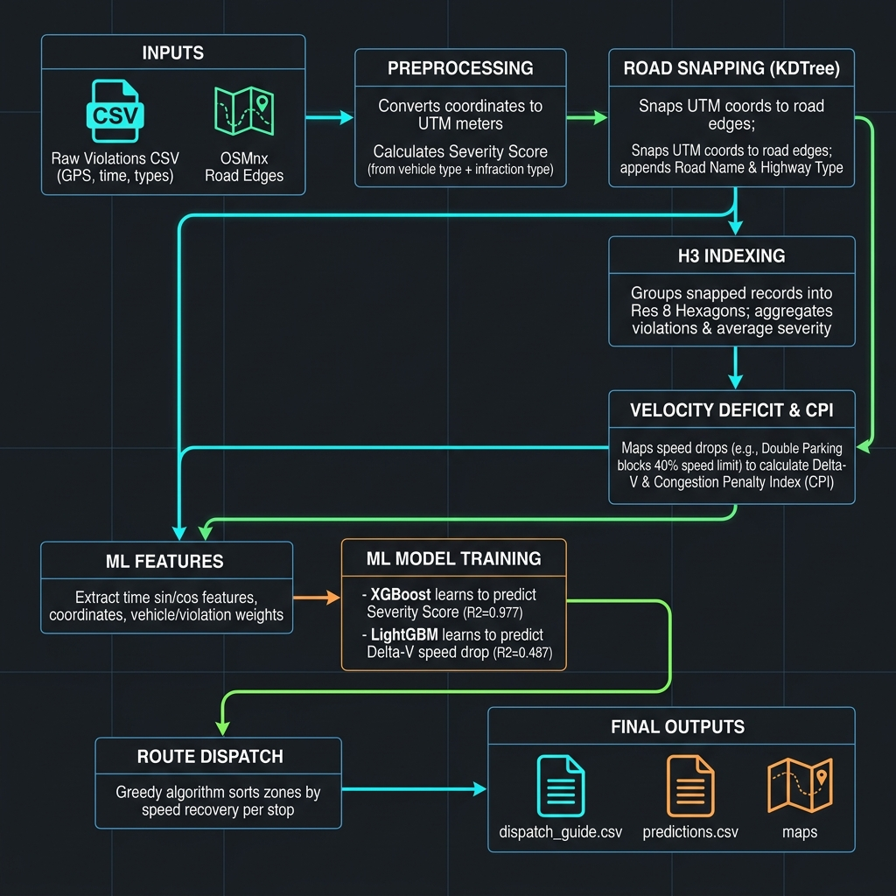

# GridLock — AI Parking Intelligence Platform

Bengaluru loses Rs. 62.4 Crore annually to illegal parking. 298,445 violations block roads, slow ambulances, and waste 2,400+ commuter hours every day. GridLock is an AI pipeline that turns raw violation records into "go here, at this time, enforce this" — replacing guesswork with data.

---

## What GridLock Does

GridLock answers three questions that traffic police cannot answer today:

1. **Where** are the worst illegal parking hotspots?
2. **When** do they peak and how do they shift throughout the day?
3. **What** is the most effective patrol route to clear them?

### The Problem

Bengaluru Traffic Police issued 298,445 parking violations between November 2023 and April 2024. This data sits in spreadsheets — it cannot tell an officer which 10 roads to patrol today, which time window matters most, or how much congestion each violation causes.

### Our Solution

A 10-step AI pipeline that processes 298K records in 125 seconds and produces:

- 776 scored hexagonal zones with congestion penalty index (CPI)
- 4-hour ahead severity predictions per zone
- 5 optimized patrol routes covering 40 priority zones
- Rs. 62.4 Crore annual economic loss quantification

---

## Pipeline Overview (run_pipeline.py)

The file `run_pipeline.py` is the complete AI pipeline. It runs end-to-end in 125 seconds.

| Step | What It Does | Output |
|------|-------------|--------|
| 1. Data Loading | Load 298K records, parse timestamps, filter invalid GPS | Clean dataframe |
| 2. CRS Conversion | EPSG:4326 to EPSG:32643 (UTM meters) | x_meters, y_meters columns |
| 3. Road Snapping | Download 450K road edges via OSMnx, KDTree snap | road_name, road_highway per violation |
| 4. H3 Indexing | Map 298K GPS points to 776 hex zones (Res 8) | h3_index per violation |
| 5. Velocity Deficit | Calculate delta-V using lane blockage factors | avg_delta_v per zone |
| 6. CPI Scoring | 0.30 x Density + 0.25 x Road + 0.30 x dV + 0.15 x Severity | cpi score per zone |
| 7. Risk Classification | Percentile qcut into Low/Medium/High/Critical | risk_level per zone |
| 8. ML Training | XGBoost severity (R2=0.977), LightGBM velocity (R2=0.487) | .pkl model files |
| 9. Predictions | Predict severity and delta-V for all 776 zones at 4 time windows | predictions.csv |
| 10. Route Optimization | Greedy algorithm: 5 routes x 8 stops, max speed recovery | dispatch_guide.csv |

---

## Dashboard Overview (dashboard.py)

The file `dashboard.py` is a Streamlit web application with 3 tabs:

### Tab 1: Executive Command Center

- **4 KPI cards** — Active choke points, rolling commuter hours saved, average speed drop, and active violations/day.
- **Interactive spatial map** — 776 H3 hexagonal zones colored by CPI (green=safe, red=severe) with interactive tooltips.
- **Play/Pause Time playback** — Simulates how congestion shifts dynamically across the 24-hour cycle.
- **Command filters** — Filter by police station neighborhood jurisdiction and road classifications in the sidebar.

### Tab 2: Smart Dispatch Guide

- **Bottleneck alert** — Shows the highest-priority zone and estimated delay recovery.
- **Towing Unit dispatch simulation** — Actionable buttons simulating towing vehicle redirection and velocity recovery gains.
- **Priority enforcement queue** — Top 10 zones ranked by speed recovery and time saved.
- **Patrol route map** — 5 color-coded patrol route paths with 8 stops each to optimize enforcement routes.

### Tab 3: Deep-Dive Hotspot Analytics

- **Temporal heatmap** — Density grid showing violations aggregated by day of week and hour.
- **Correlation scatter plot** — Violation density vs average speed to illustrate speed deficit trends.
- **Socio-Economic Impact Planner** — Mapped neighborhood report calculating monthly fuel cost waste, productivity loss, and carbon offset (tree planting) metrics.

---

## Output Files Explained

All outputs are in the `outputs/` folder (3.3MB total). The dashboard reads these files directly.

### h3_analysis.csv (360KB)

Per-hex zone statistics for all 776 zones:

| Column | Description |
|--------|-------------|
| h3_index | Uber H3 hexagonal zone ID |
| center_lat, center_lon | Center coordinates of the hex |
| violation_count | Total violations in this zone |
| violations_per_day | Average violations per day |
| avg_severity | Average severity score |
| avg_delta_v | Average speed deficit (km/h) |
| avg_time_loss | Average time loss (min/km) |
| cpi | Congestion Penalty Index (0.128 - 0.594) |
| risk_level | Low / Medium / High / Critical |
| enforcement_priority | Weighted rank for patrol dispatch |
| top_violation | Most common violation type |
| top_vehicle | Most common vehicle type |
| police_station | Responsible police station |
| primary_road | Most affected road |
| highway_type | Road classification |
| peak_hour | Hour with most violations |
| boundary | Hex polygon coordinates |

### predictions.csv (92KB)

Predicted severity and velocity deficit for all 776 zones at 4 time windows:

| Column | Description |
|--------|-------------|
| h3_index | Zone ID |
| predicted_hour | 8, 12, 17, or 20 (24h format) |
| predicted_severity | XGBoost prediction (0-2 scale) |
| predicted_delta_v | LightGBM prediction (km/h) |
| risk_level | Risk classification |

### dispatch_guide.csv (3KB)

Top 30 priority zones for enforcement:

| Column | Description |
|--------|-------------|
| h3_index | Zone ID |
| location | Lat, Lon of zone center |
| primary_road | Road to patrol |
| violations_per_day | Daily violations |
| velocity_recovery_kmh | Speed recovered if cleared |
| cpi | Congestion score |
| risk_level | Risk class |
| police_station | Jurisdiction |
| total_time_saved_hrs | Commuter hours saved per day |

### economic_impact.csv (236 bytes)

Single-row summary of city-wide economic impact:

| Column | Description |
|--------|-------------|
| daily_violations | ~1,990 violations/day |
| avg_speed_deficit_kmh | 5.3 km/h average |
| daily_commuter_hours_wasted | ~2,414 hours/day |
| daily_fuel_wasted_liters | ~308 liters/day |
| total_daily_loss_inr | ~Rs. 17.1 Lakh/day |
| annual_loss_inr | ~Rs. 62.4 Crore/year |

### hotspot_map.html (918KB)

Interactive Folium map with all 776 hexagonal zones colored by risk level. Red = critical, orange = high, yellow = medium, green = low. Click any hex to see CPI, violations, road name, and police station.

### route_map.html (53KB)

Interactive Folium map with 5 patrol routes. Each route has 8 color-coded stops. Click any marker to see the road name, CPI, and risk level.

### xgb_severity.pkl (924KB) and lgb_velocity.pkl (570KB)

Trained ML model files serialized with Joblib. Loaded by the dashboard for prediction display.

### temporal_density.csv (2KB)

Violations aggregated by day of week and hour. Used for the heatmap in the Analytics tab.

---

## How the Scoring Works

### Congestion Penalty Index (CPI)

```
CPI = 0.30 x Violation Density + 0.25 x Road Significance + 0.30 x Delta-V + 0.15 x Severity
```

Each component is normalized to 0-1 before weighting.

### Velocity Deficit (Delta-V)

Each violation type blocks a percentage of lane capacity:

| Violation Type | Lane Blockage |
|---------------|---------------|
| Double Parking | 40% |
| Parking in Main Road | 30% |
| Parking Near Crossing | 25% |
| Parking Near Bus Stop | 20% |
| Wrong Parking | 15% |
| No Parking | 10% |

Applied to road-specific speed limits:
- Primary road (50 km/h) + Double parking (40%) = 30 km/h actual speed, Delta-V = 20 km/h
- Residential road (30 km/h) + Wrong parking (15%) = 25.5 km/h actual speed, Delta-V = 4.5 km/h

### Risk Classification

Percentile-based quartile split:
- **Critical** (top 25%) — 194 zones
- **High** (25-50%) — 193 zones
- **Medium** (50-75%) — 194 zones
- **Low** (bottom 25%) — 195 zones

---

## Key Results

| Metric | Value |
|--------|-------|
| Records analyzed | 298,445 |
| H3 hex zones | 776 |
| Road snapping accuracy | 95.4% (284K of 298K within 100m) |
| Unique roads mapped | 1,183 |
| Critical risk zones | 194 |
| High risk zones | 193 |
| Avg speed deficit | 5.3 km/h |
| CPI range | 0.128 - 0.594 |
| XGBoost R2 (severity) | 0.977 |
| LightGBM R2 (velocity) | 0.487 |
| Daily economic loss | Rs. 17.1 Lakh |
| Annual economic loss | Rs. 62.4 Crore |
| Pipeline runtime | 125 seconds |

---

## Tech Stack

| Component | Technology | Why |
|-----------|-----------|-----|
| Data Processing | Pandas, NumPy | Standard for 298K row datasets |
| Spatial Indexing | Uber H3 (Res 8) | Hexagonal grids, uniform neighbors |
| Road Network | OSMnx | Free OpenStreetMap road data |
| Spatial Queries | SciPy KDTree | Fast nearest-neighbor search |
| CRS Conversion | GeoPandas (EPSG:32643) | UTM meters for distance math |
| ML - Severity | XGBoost | Best for tabular data, R2=0.977 |
| ML - Velocity | LightGBM | Fast training, R2=0.487 |
| Route Optimization | Custom Greedy | Maximizes speed recovery per stop |
| Maps | Folium | Interactive web maps |
| Charts | Plotly | Interactive visualizations |
| Dashboard | Streamlit | Rapid prototyping, easy deployment |

---

## System Architecture




---

## Quick Start (For Judges)

If you want to run the project locally:

```bash
git clone https://github.com/aaryan359/flipkart-gridlock.git
cd flipkart-gridlock
pip install -r requirements.txt
streamlit run dashboard.py
```

Opens at `http://localhost:8501`. The `outputs/` folder is pre-generated — the dashboard works immediately.

## How to Test

### Option 1: Run Streamlit Dashboard Locally

To start the interactive spatial UI using pre-generated datasets:
```bash
pip install -r requirements.txt
streamlit run dashboard.py
```

### Option 2: Re-run spatial AI pipeline locally

To run the complete 10-step pipeline from raw records and OSM data:
```bash
pip install pandas numpy geopandas h3 shapely scipy osmnx xgboost lightgbm scikit-learn joblib
python run_pipeline.py
```
Takes ~125 seconds. Regenerates all data and map files in the `outputs/` directory.

### Option 3: Jupyter / Kaggle Notebook

Upload `GridLock_Full.ipynb` and the violation CSV dataset to Jupyter/Kaggle and execute all cells.

---

